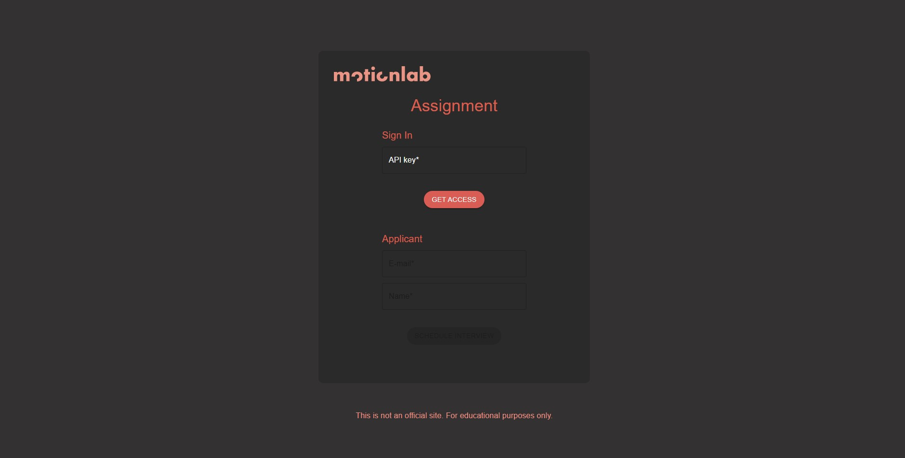

# Usage:

```bash
git clone https://github.com/robert-belan/motionquest.git

cd motionquest
npm install

npm run deploy
```

- V adresari _server_ je nutne vytvorit certifikat(**cert.pem**) a klic(**key.pem**) pro spravnou funkci HTTPS serveru, napriklad pomoci _openssl_. Pote bude aplikace spustitelna.

- Pro spravnou funkcnost by bylo nutne doplnit v _.env_ souboru jeste prislusne ENDPOINTy a zadat spravne BASE_URL
